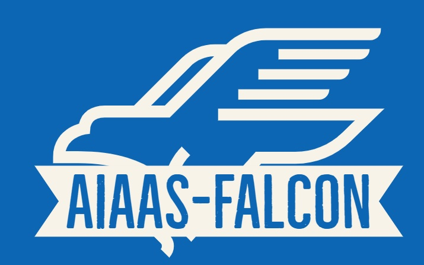

# AIaaS Falcon


<h4 align="center">
    <p>
        <a href="#shield-installation">Installation</a> |
        <a href="#fire-quickstart">Quickstart</a> |
    <p>
</h4>


## Description

AIaaS_Falcon is Generative AI - LLM library interacts with open source LLMs such as llama2 , mistral  & Orca APIs, allowing operations such as listing models, creating embeddings, and generating text based on certain configurations.AIaaS_Falcon helps to invoking the RAG pipeline in seconds.

## :shield: Installation

Ensure you have the `requests` and `google-api-core` libraries installed:

```bash
pip install aiaas-falcon
```


if you want to install from source

```bash
git clone https://github.com/Praveengovianalytics/AIaaS_falcon && cd AIaaS_falcon
pip install -e .
```

### Methods
- `health(self)` - Check Health Status of Endpoint
- `list_models(self)` - Retrieves available models.
- `create_embedding(self, file_path)` - Creates embeddings from a provided file.
- `generate_text(self, chat_history=[], query="",use_file=0,type="general", use_default=1, conversation_config={}, config={})` - Generates text based on provided parameters.


## :fire: Quickstart

```python
# Example usage

from aiaas_falcon import Falcon  # Make sure the Falcon class is imported

# Initialize the Falcon object with the API key, host name and port
falcon = Falcon(api_key='_____API_KEY_____', host_name_port='34.16.138.59:8888', transport="rest",protocol="http")

# List available models
model = falcon.list_models()
print(model)

# Check if any model is available
if model:
    # Create an embedding
    response = falcon.create_embedding(['/content/01Aug2023.csv'],'general')
    print(response)
    print('Embedding Success')

    # Define a prompt
    prompt = 'What is Account status key?'

    # Generate text based on the prompt and other parameters
    completion = falcon.generate_text(
         query=prompt,
         chat_history=[],
         use_default=1,
         use_file=1,
         type="general",
         conversation_config={
            "k": 5,
            "fetch_k": 50000,
            "bot_context_setting": "Do note that Your are a data dictionary bot. Your task is to fully answer the user's query based on the information provided to you."
         },
         config={"model":"mistral-7b","max_new_tokens": 1200, "temperature": 0.4, "top_k": 40, "top_p": 0.95, "batch_size": 256}
    )

    print(completion)
    print("Generate Success")

else:
    print("No suitable model found")
```

## Conclusion

AIaaS_Falcon library simplifies interactions with the LLM API's, providing a straightforward way to perform various operations such as listing models, creating embeddings, and generating text.

## Authors

- [@Praveengovianalytics](https://github.com/Praveengovianalytics)
- [@zhuofan](https://github.com/zhuofan-16)

## Google Colab

- [Get start with aiaas_falcon](https://colab.research.google.com/drive/1k5T_FO9SnlN0zOQfR7WFXSRFkfgiL1cE?usp=sharing)

## Badges

[](https://choosealicense.com/licenses/mit/)
